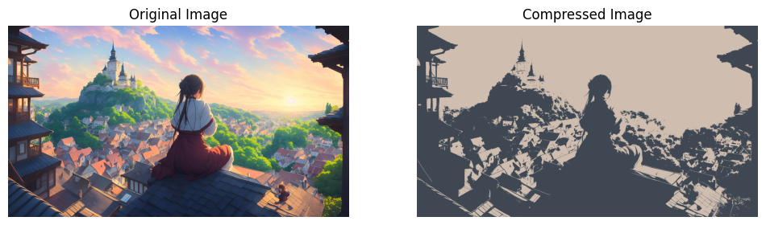

# image-video-compression
Using K-Means and Fuzzy C-Means Clustering techniques performing image and video compression.

## Image Compression Example

Below is the comparison between the original and compressed image using K-Means clustering (K=2):

Below is the comparison between the original and compressed image using Fuzzy C-means clustering(k=3):

